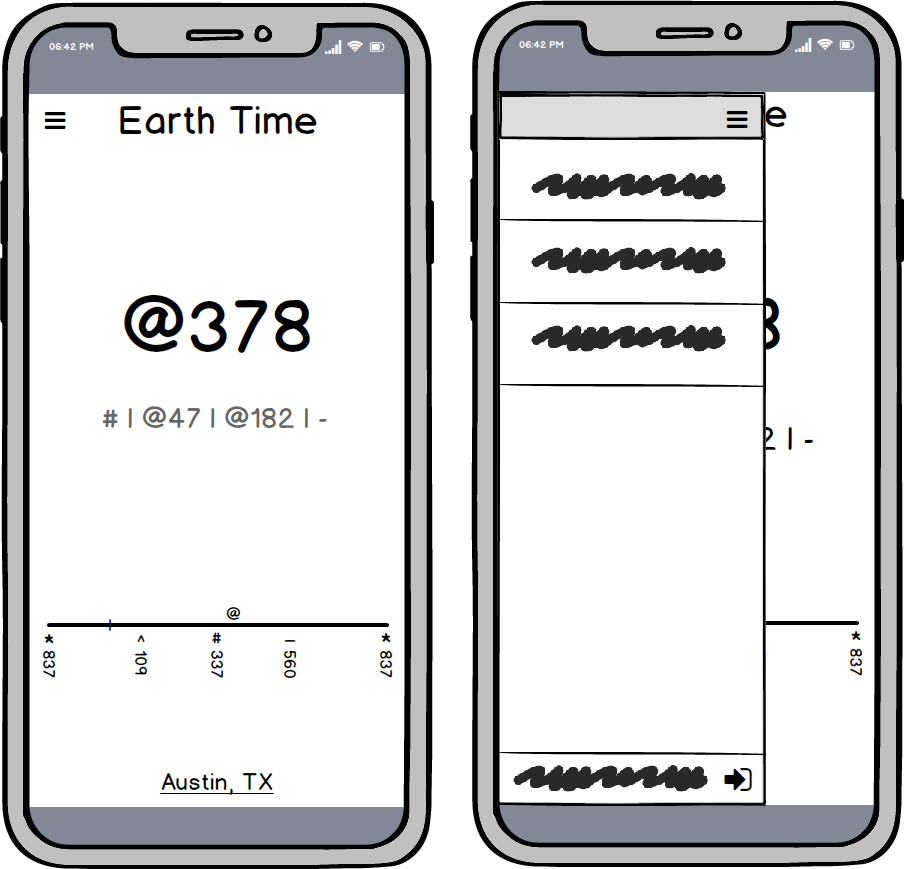
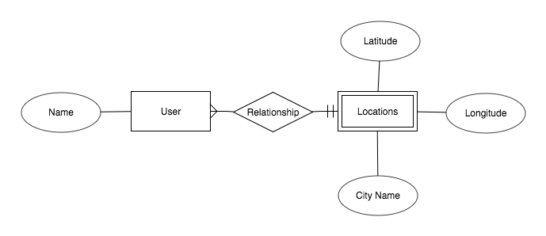

# Earth Time Introduction

> The Earth Time web app is currently in production. Once complete, a demo link will be put here. Until then, please follow development on [Trello](https://trello.com/b/sU6SPRV5).

Earth Time is a new standard of time built to notate and recognize time as absolute worldwide events first, and local events as relative events second. Currently, time is reckoned primarily locally, with timezones in place as a convenient way to keep local times synchronized around the world. The bias towards a local time first makes it difficult to imagine the reality of the global world around us.

Attempts have been made previously to synchronize the world's time via a single unified timecode (see [Swatch Internet Time](https://en.wikipedia.org/wiki/Swatch_Internet_Time) for example), but the local cycle of sunrise and sunset is lost in the process. Rather than solving all issues, it simply traded one for another.

What I’m attempting to fix is the bias either way. Rather than following a strictly global time, I’m attempting to use the global time as an absolute reference, while holistically incorporating the natural local rhythms of Earth’s solar cycles.

My hope is that this holistic view of time notation will lead people to be more aware of their natural relative connection with the Earth’s cycles of night and day, as well as a global view of humans living on the planet in a complex interconnected web of ecosystems.

The benefits of using a global time to refer to local events are numerous, but most tangibly is the immediate benefit of coordinating global communication across timezones. Every person that refers to a specific time (`@178` for example) is referring to it in a global context regardless of physical location on the planet. It is `@178` for everyone at the same time, world-wide. In our internet fueled society, this has become increasingly important. Gone are the days when the only people that coordinated global communication were global businesses and deployed military personnel.

## Example Clockface & Notation Cheatsheet

For more information regarding the philosophy of this project, check out the [expanded documentation](.docs/original-documentation.md) and the dropdown menu below for a quick reference to the Earth Time clock face notation.

Earth Time Notation Cheatsheet

Name | Notation | Example | Explanation
--- | --- | --- | ---
Global Time | `@` | `@045` or `@45` | The number of beats since midnight ETO
Day | `:` | `:005` or `:5` | The number of days after the SS containing day ETO
Year | `!` | `!2015` | The number of solar years since Christ’s birth ETO
Smaller Beat Denominations | `.` | `@045.27` or `@45.27` | Denotes infinitely smaller denominations of beats
Midnight | `*` | `*837` | The relative midnight (in beats) based on your location from ETO
Sunrise | `^` | `^109` | The relative sunrise (in beats) based on your location from ETO
Midday | `#` | `#337` | The relative midday (in beats) based on your location from ETO
Sunset | `-` | `-560` | The relative sunset (in beats) based on your location from ETO
Wake Time | `{` | `{123` | The global time you wake up
Bed Time | `}` | `}159` | The global time you go to bed
Southern Solstice | `ss` | `ss` = `:0` in `!2015` | The moment when the sun is at the most southern point in relation to Earth (represented in days). The first day of Winter in the northern hemisphere.
Mid-Southern Solstice | `mss` | `mss` = `:46` in `!2015` | The halfway point between the southern solstice and northward equinox (represented in days)
Northward Equinox | `ne` | `ne` = `:91` in `!2015` | When the sun is traveling northward and crosses the equator (represented in days) The first day of Spring in the northern hemisphere.
Mid-Northward Equinox | `mne` | `mne` = `:137` in `!2015` | The halfway point between the northward equinox and northern solstice (represented in days)
Northern Solstice | `ns` | `ms` = `:182` in `!2015` | The moment when the sun is at the most northern point in relation to Earth (represented in days) The first day of Summer in the northern hemisphere.
Mid-Northern Solstice | `mns` | `mns` = `:228` in `!2015` | The halfway point between the northern solstice and southward equinox (represented in days)
Southward Equinox | `se` | `se` = `:274` in `!2015` | When the sun is traveling southward and crosses the equator (represented in days) The first day of Autumn in the northern hemisphere.
Mid-Southward Equinox | `mse` | `mse` = `:319` in `!2015` | The halfway point between the southward equinox and southern solstice (represented in days)
Relative Time Mark | `\|` | `^\|@52\|` `\|@20\|@` `:\|:30\|` `\|:19\|mss` `@\|!1:15@32\|` `:159\|:5\|` | 52 beats after sunrise 20 beats before current time 30 days after current day 19 days before mid-southern solstice 1 year, 15 days, 32 beats from now 5 days after my birthday (the 159th day)
Absolute Time | | `!2015:287@008` | Year: 2015 Day: 287 Beat: 008
Time Duration | `%` | `@53%` `:16%` `!12%` `!27:157%` | 53 beats long 16 days long 12 years long My current age

## General Assembly Unit 2 Project Proposal

The Minimum Viable Product version of the Earth Time web app is a much simplified version of what the final app will be. What follows is the specs for the MVP. A central Kanban board tracking development is located [here on Trello](https://trello.com/b/sU6SPRV5). For the most up to date developments, take a quick look inside.

### Attack Plan

The Unit 2 project requirements are to build a fully functioning [CRUD application](https://en.wikipedia.org/wiki/Create,_read,_update_and_delete) with a persistent database, and to deploy it on the internet. To meet the project requirements, both the assignments deliverables as well as the requirements to get the clock to work properly, I'll be using several pre-existing technologies. They are listed as follows:

- I'll be using HerokuApp to deploy
- Unix epoch time stamp converter
- Sunrise/sunset API database
- Bootstrap framework for responsive design
- OAuth to allow users to create a personal login
- Google Maps API to save latitude and longitude data to user's accounts

The database structure is simple with very few connections:

The routes needed are to be able to create and access user profiles, and to update the user's location. That route architecture will look something like:

URL | HTTP Verb | Action | Description
--- | --- | --- | ---
users/new | POST | Create | Create new user account
users/:id | GET | Show | Access user account
location/:id/update | PATCH | Update | Update user location
location/:id | GET | Show | Access user location

### User Stories

1. As a user I want to be able to quickly see what time it is in beats so I don't have to do parse through a bunch of complicated jargon
1. As a user, I want to be able to convert UTC time into beats easily so I feel like using beats will fit into my life as it is right now
1. As a user, I want to be able to see what time it is in beats on my phone so I can use it as it's relevant
1. As a user, I want to know how the beats relates to my current local time so that I have a reference of what the beats means
1. As a user, I want to be able to save my current location to a user account so I don't have to keep adding it every time I want to use this new type of time
1. As a user, I want to be able to add my location to the clock without needing to know my lat/long so that the app is immediately useful
1. As a user, I want to most important information about earth time the most readily apparent so I don't get lost in the details of so much info at once
1. As a user, I want the interface to be appealing so I don't feel like this is a hacked together prototype
1. As a user, I want to be able to log in conveniently with a level of trust that my data won't be misused
1. As a user, I want the interface to look good both on mobile and desktop so that I can use it effectively on all devices
1. As a user, I would like a handy built in reference to what all the symbols mean to help make the transition easier
